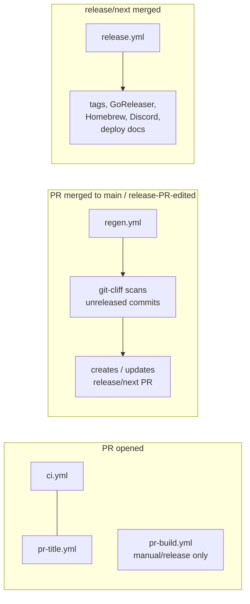

# CI/CD Workflows

## How releases work



### 1. PR phase

These workflows and external checks run automatically when a PR targets `main`. `pr-build.yml` is available for opt-in artifact builds and is dispatched by `regen.yml` for the generated release PR:

| Workflow | Trigger | Purpose |
|----------|---------|---------|
| `ci.yml` | `pull_request` | Lint, build, test (JS + Go + release scripts) |
| `pr-build.yml` | `workflow_dispatch` | Opt-in snapshot build via GoReleaser, upload artifacts, post install comment; `regen.yml` dispatches it for `release/next` |
| `pr-title.yml` | `pull_request_target` | Validate PR title matches [conventional commits](https://www.conventionalcommits.org/) |
| `regen.yml` | `pull_request` | No-op for non-`release/next` PRs; reports a status check so branch protection stays green |
| Greptile GitHub App | `pull_request` | External AI review/status check configured by `.greptile/`; staged as non-required until release-PR skip behavior is verified |

Commit prefixes determine release behavior:
- `feat: ...` → minor version bump, **Features** section
- `fix: ...` → patch version bump, **Fixes** section
- `perf: ...` → patch version bump, **Features** section
- `security: ...` → patch version bump, **Security** section (shown at the top, right after Breaking)
- `feat!: ...` / `fix!: ...` / `security!: ...` / `BREAKING CHANGE:` footer → major version bump, **Breaking** section
- `docs: ...` → **Docs** section, no bump on its own (appears in the next release if one is triggered)
- Everything else (`ci:`, `refactor:`, `chore:`, `test:`, `style:`, `build:`, `revert:`) → skipped entirely

Scopes are optional but encouraged for monorepo areas. Use `feat(peering): ...`, `fix(web): ...`, `docs(cli): ...`, etc. The scope appears as a bold tag in the changelog bullet: `- **(peering)** reconnect after system sleep`. Unscoped commits render without the tag.

Because we use **rebase merge** (not squash merge), every atomic commit on a feature branch lands on `main` as-is. Each commit must follow conventional commits because they all become changelog material.

### 2. Regen phase (push to main, or release-PR edited)

`regen.yml` runs on every push to `main` and on every PR-body edit / synchronize for `release/next`:

1. Decides its mode:
   - `skip` for non-`release/next` PRs (early-exits, status check stays green so branch protection isn't broken for normal PRs).
   - `noop` for events sent by the `github-actions[bot]` (the workflow's own force-push). Status check still goes green on the new SHA, breaking the loop.
   - `regen` otherwise.
2. Reads existing prose (if any) from the open `release/next` PR body, between the `<!-- prose-start -->` and `<!-- prose-end -->` markers.
3. `version.sh` exits early if HEAD is a release commit (loop prevention) or there are no releasable commits.
4. [git-cliff](https://git-cliff.org/) scans commits between the last `v*` tag and HEAD and computes the next version (semver bump from the highest-impact commit).
5. The script writes:
   - `apps/website/src/content/docs/changelog.mdx`: heading + prose + bullets + horizontal rule, inserted above the most recent entry.
   - `.github/release-target`: one line, the next version tag. Gives the release commit a real diff to anchor on.
   - `pr-body.md`: full PR body (template + prose markers + bullets markers). Not committed; passed to peter-evans as the body source.
6. `peter-evans/create-pull-request` creates or updates `release/next` with `add-paths` limiting the commit to `changelog.mdx` and `release-target`.
7. `pr-build.yml` is dispatched via `workflow_dispatch` to build artifacts for the release PR.

To edit prose for an upcoming release: open the `release/next` PR and edit the body between the `<!-- prose-start -->` markers. The next regen run reads your edit, regenerates `changelog.mdx` and the bullets section of the body, and force-pushes the release commit. No file in the repo, no script to run.

### 3. Release phase (release/next merged)

`release.yml` triggers when `release/next` is merged (or on manual tag push):

1. The `tag` job extracts the version from the PR title (`release: v1.2.0`), creates and pushes the git tag, and dispatches the release build. Because `changelog.mdx` is already on `main` (it's part of the merged release commit), there's no separate changelog write here.
2. The `release` job extracts the latest entry from `changelog.mdx` and passes it to GoReleaser via `--release-notes` (binaries + GitHub Release + Homebrew tap).
3. `notify-discord.sh` reads the same latest entry from `changelog.mdx` and posts the whole entry (curated prose plus auto-generated bullets) to Discord, so subscribers always see what changed without clicking through.
4. The release workflow stops after publishing artifacts and sending Discord notifications; docs deployment is intentionally not part of release.

## Branch protection

Branch protection on `main` should require the `regen / regen` status check. The `regen.yml` workflow always reports the check (passing as a no-op for non-`release/next` PRs and for the workflow's own force-pushes), so the requirement doesn't break unrelated PRs. For the release PR specifically, the check ensures `changelog.mdx` and the PR body are in sync with both the latest prose and the latest commits on `main` before the merge button works.

Greptile is configured in `.greptile/` to post a GitHub status check for normal PRs, review only the initial PR open event, and skip generated `release: ...` PRs from `github-actions[bot]`. Keep Greptile **non-required** during staged rollout until a test `release/next` cycle proves skipped release PRs still produce a green/skipped status check. If skipped release PRs do not produce a mergeable check, either allow Greptile to review `release/next` or leave Greptile non-required for release flow.

### Greptile staged rollout checklist

Use this checklist before adding Greptile to required branch-protection checks:

1. Confirm the repository is enabled in the Greptile dashboard and the GitHub App has access to this repo.
2. Open a normal PR that targets `main`; do not push directly to `main`, because Greptile reviews PRs.
3. Confirm Greptile posts a review status check from `.greptile/config.json` (`statusCheck: true`).
4. Merge the normal PR after existing required checks pass.
5. Let `regen.yml` create or update `release/next`.
6. Confirm the generated `release/next` PR is still mergeable while Greptile is configured to skip `github-actions[bot]` / `release:` PRs.
7. Only after both PR types are mergeable should Greptile be added as a required status check.
8. If `release/next` is blocked because the required Greptile check is missing, remove Greptile from required checks or change `.greptile/config.json` to allow Greptile to review release PRs.
9. If no Greptile check or comment appears after commenting `@greptileai`, verify the repo is enabled at app.greptile.com/review/github and wait for first-time indexing to finish.

`Require branches to be up to date before merging` is **not** needed: the regen workflow runs on every push to `main` and force-syncs `release/next` automatically, so by construction the head SHA always reflects current `main`.

## Security model

### Permissions

Workflows set `permissions: {}` at the top level (deny-all), then grant minimum required permissions per job. `ci.yml` is the exception: it uses workflow-level `permissions: contents: read` since both jobs need the same access.

| Workflow | Job | Permissions |
|----------|-----|-------------|
| `ci.yml` | `js`, `go` | `contents: read` |
| `pr-title.yml` | `lint` | `pull-requests: read` |
| `pr-build.yml` | `build` | `contents: read`, `pull-requests: write` |
| `regen.yml` | `regen` | `contents: write`, `pull-requests: write`, `actions: write` |
| `release.yml` | `tag` | `contents: write`, `actions: write` |
| `release.yml` | `release` | `contents: write` |

### Action pinning

All third-party actions are pinned to full commit SHAs to prevent supply-chain attacks. The version tag is kept as a comment for readability:

```yaml
- uses: actions/checkout@de0fac2e4500dabe0009e67214ff5f5447ce83dd # v6
```

### Fork PR safety

- `pull_request` triggers: run fork code but with a **read-only** `GITHUB_TOKEN` and **no access to secrets**.
- `workflow_dispatch` (`pr-build.yml`): is opt-in and checks out the requested PR head to build artifacts. Do not manually dispatch it for untrusted fork code.
- `pull_request_target` (`pr-title.yml`): runs **base branch code**, never checks out or executes fork code. Only reads the PR title via the API.
- No workflow uses `pull_request_target` + `actions/checkout` with the PR ref (the known anti-pattern for secret exfiltration).

### Environments

The `release` job uses the `release` environment. Sensitive secrets such as `DISCORD_WEBHOOK_URL` should be configured as environment secrets there, not as repo-level secrets. This scopes them to only the release job and allows deployment branch restrictions.

### Loop prevention

Two mechanisms prevent infinite workflow loops:

1. `version.sh` checks if HEAD is a release commit (`release: vX.Y.Z`) and exits early.
2. `regen.yml` skips the regen work for events whose sender is `github-actions[bot]` (its own force-pushes and PR-body edits), but still completes the job successfully so the required status check is reported on the new SHA.

### Merge strategy

The repo uses **rebase merge** for feature PRs (Settings → General → Pull Requests). This preserves atomic commit history on `main` so git-cliff can read each commit individually. Squash merge would collapse a PR into a single commit and lose the structured history.

The release PR (`release/next`) is also rebase-merged: it lands as a single `release: vX.Y.Z` commit on `main` containing the changelog update.

## Repo settings

These settings should be configured in the GitHub repository:

1. **Settings → Actions → General → Workflow permissions**: select **"Read repository contents and packages permissions"** (least-privilege default for all workflows).
2. **Settings → Environments**: create a `release` environment with deployment branches restricted to `main`. Move `DISCORD_WEBHOOK_URL` there if release notifications are enabled.
3. **Settings → Branches → main → Branch protection**: require the `regen / regen` status check. During Greptile staged rollout, observe its status check on normal PRs and on a generated `release/next` PR before adding it as required. Don't enable "require branches to be up to date before merging."

## Scripts

Workflow scripts live in `.github/workflows/scripts/`, colocated with the workflows that use them:

| Script | Used by | Purpose |
|--------|---------|---------|
| `version.sh` | `regen.yml` | Compute next version via git-cliff, write changelog.mdx, write `.github/release-target`, render PR body. Also handles `--extract-prose` (parses prose out of a PR body on stdin) for the workflow's read-existing-prose step. |
| `extract-release-notes.sh` | `release.yml`, `notify-discord.sh` | Extract the body of the latest `changelog.mdx` entry (no heading, no trailing `---`). Single source of truth for what GoReleaser and the Discord post see. |
| `notify-discord.sh` | `release.yml` | Send release notification to Discord webhook (posts the latest `changelog.mdx` entry, fetched via `extract-release-notes.sh`) |
| `version_test.sh` | `ci.yml`, manual | End-to-end tests for `version.sh` using scratch git repos |
| `notify_discord_test.sh` | `ci.yml`, manual | Tests for `notify-discord.sh` |
| `extract_release_notes_test.sh` | `ci.yml`, manual | Tests for `extract-release-notes.sh` |
