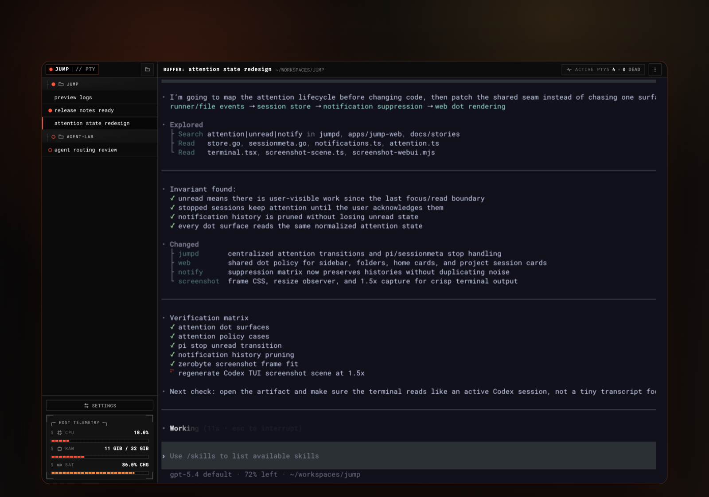
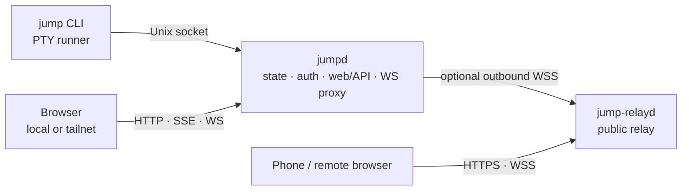

<div align="center">
  

  <h1>jump</h1>

  <p><strong>Browser-first session manager for AI agents, test runners, and long-running commands.</strong></p>
  <p><code>jump</code> wraps commands in managed PTY sessions, keeps them alive outside the browser tab, and exposes them through a local Web UI.</p>
  <p>Remote access is optional: use built-in Tailscale/tsnet for private access or <code>jump-relayd</code> for public HTTPS/WSS access through one outbound agent connection.</p>
</div>

<p align="center">
  
</p>

## Architecture



- `jump`: launches and attaches to local PTY sessions.
- `jumpd`: discovers sessions, serves the Web UI/API, stores state, and connects to optional remote transports.
- `jump-relayd`: transport-only public relay; it does not store sessions.

## Features

- **Durable command sessions**: run agents, test watchers, builds, and other long-running commands without tying them to one terminal window.
- **Browser terminal for agent/TUI workflows**: open `jump` to switch projects, attach to live PTY sessions, and keep Codex-style TUIs usable in the browser.
- **Notifications and attention tracking**: browser notifications, unread markers, stopped-session states, and attention dots help you spot which session needs review.
- **Easy remote access, two ways**:
  - **Tailscale/tsnet** for private tailnet access without exposing the daemon publicly.
  - **`jump-relayd`** for public HTTPS/WSS access through an outbound-only relay connection.
- **Local-first by default**: `jumpd` listens on `127.0.0.1` unless you explicitly opt into LAN, tailnet, or relay access.

## Quick start (local)

Install the latest release:

```bash
curl -fsSL https://raw.githubusercontent.com/sting8k/jump/main/scripts/install.sh | bash
```

Optional pin/custom install directory:

```bash
curl -fsSL https://raw.githubusercontent.com/sting8k/jump/main/scripts/install.sh | JUMP_VERSION=vX.Y.Z INSTALL_DIR=/usr/local/bin bash
```

Launch sessions and open the local Web UI:

```bash
jump pi                    # launch a coding agent
jump pytest --watch        # launch a watcher
jump make build            # launch any long-running command
jump                       # open the Web UI
```

Default local URL:

```text
http://127.0.0.1:8790
```

Useful daemon commands:

```bash
jumpd status
jumpd auth
jumpd doctor
jumpd start
jumpd stop
```

## Local network access

`jumpd` binds to `127.0.0.1` by default. To expose it on LAN, VPN, or container networks, opt in explicitly:

```toml
# ~/.config/jump/host.toml
listen = "0.0.0.0"
port = 8790
```

`JUMPD_LISTEN=0.0.0.0` can override this for systemd/Docker. Do not expose plain HTTP to untrusted networks without TLS, VPN, or reverse proxy protection.

## Remote access

### Relay mode

`jumpd` connects out to a public `jump-relayd`; browsers connect to the relay.

`~/.config/jump/host.toml`:

```toml
[remote]
mode = "relay"

[relay]
enabled = true
url = "wss://your-relay.example.com/_jump/agent"
token = "replace-with-a-shared-secret"
```

Relay server:

```bash
jump-relayd -listen 127.0.0.1:8791 -token-file /etc/jump-relayd/token
```

Put HTTPS in front of the relay with nginx, Caddy, Cloudflare, or similar. Official release archives include `jump`, `jumpd`, and `jump-relayd`. See `docs/product/remote-access.md` for relay and tsnet details.

### Tailscale/tsnet mode

Use `jumpd tsnet` to set up private tailnet access without a public relay.

## Files

| Path | Purpose |
| --- | --- |
| `~/.config/jump/host.toml` | Daemon listener, remote mode, relay, Tailscale, host behavior. |
| `~/.config/jump/settings.jsonc` | Web UI/user settings. |
| `~/.local/state/jump/` | Runtime state, auth token, logs, project list, session metadata. |
| `/tmp/jump-sessions/` | Local runner socket discovery. |


## Repo map

| Path | Purpose |
| --- | --- |
| `cli/jump` | CLI runner and PTY server. |
| `services/jumpd` | Local daemon, API, Web UI embed, auth, relay client. |
| `services/jump-relayd` | Public relay server. |
| `apps/jump-web` | Preact Web UI. |
| `apps/website` | Documentation site. |
| `packages/*` | Shared paths, workspace, scrollback, relay protocol, adapter code. |

## Project docs

- Operating model: `docs/HARNESS.md`
- Product architecture: `docs/ARCHITECTURE.md`
- Remote access contract: `docs/product/remote-access.md`
- Validation matrix: `docs/TEST_MATRIX.md`

## License

MIT
