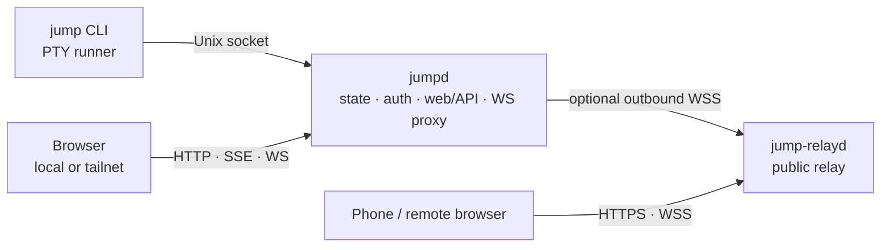

<p align="center">
  
</p>

# jump

**Browser-first session manager for AI agents, test runners, and long-running commands.**

`jump` wraps commands in managed PTY sessions, keeps them alive outside the browser tab, and exposes them through a local Web UI. Remote access is optional: use built-in Tailscale/tsnet for private access or `jump-relayd` for public HTTPS/WSS access through one outbound agent connection.

## Architecture



- `jump`: launches and attaches to local PTY sessions.
- `jumpd`: discovers sessions, serves the Web UI/API, stores state, and connects to optional remote transports.
- `jump-relayd`: transport-only public relay; it does not store sessions.

## Install

Release automation, Homebrew taps, and public install scripts are not restored yet. Build the binaries from this branch:

```bash
git clone https://github.com/sting8k/jump.git
cd jump
git checkout dev

mkdir -p ~/.local/bin
TMPDIR=/tmp GOWORK=$PWD/go.work go build -o ~/.local/bin/jump ./cli/jump/cmd/jump
TMPDIR=/tmp GOWORK=$PWD/go.work go build -o ~/.local/bin/jumpd ./services/jumpd/cmd/jumpd
TMPDIR=/tmp GOWORK=$PWD/go.work go build -o ~/.local/bin/jump-relayd ./services/jump-relayd/cmd/jump-relayd
```

Add `~/.local/bin` to `PATH` if needed. If you change Web UI code, run `pnpm --filter @jump/web build` before rebuilding `jumpd` so the embedded assets are current.

## Run

```bash
jump pi                    # launch a coding agent
jump pytest --watch        # launch a watcher
jump make build            # launch any long-running command
jump                       # open the Web UI
```

Default local UI:

```text
http://127.0.0.1:8790
```

To expose `jumpd` on LAN/VPN/container networks, opt in explicitly:

```toml
# ~/.config/jump/host.toml
listen = "0.0.0.0"
port = 8790
```

`JUMPD_LISTEN=0.0.0.0` can override this for systemd/Docker. The default stays `127.0.0.1`; don't expose plain HTTP to untrusted networks without TLS/VPN/reverse proxy protection.

Useful daemon commands:

```bash
jumpd status
jumpd auth
jumpd doctor
jumpd start
jumpd stop
```

## Remote access

### Relay mode

`jumpd` connects out to a public `jump-relayd`; browsers connect to the relay.

`~/.config/jump/host.toml`:

```toml
[remote]
mode = "relay"

[relay]
enabled = true
url = "wss://your-relay.example.com/_jump/agent"
token = "replace-with-a-shared-secret"
```

Relay server:

```bash
jump-relayd -listen 127.0.0.1:8791 -token-file /etc/jump-relayd/token
```

Put HTTPS in front of the relay with nginx, Caddy, Cloudflare, or similar. Official release archives include `jump`, `jumpd`, and `jump-relayd`. See `docs/product/remote-access.md` for relay and tsnet details.

### Tailscale/tsnet mode

Use `jumpd tsnet` to set up private tailnet access without a public relay.

## Files

| Path | Purpose |
| --- | --- |
| `~/.config/jump/host.toml` | Daemon listener, remote mode, relay, Tailscale, host behavior. |
| `~/.config/jump/settings.jsonc` | Web UI/user settings. |
| `~/.local/state/jump/` | Runtime state, auth token, logs, project list, session metadata. |
| `/tmp/jump-sessions/` | Local runner socket discovery. |

## Development

```bash
pnpm install
TMPDIR=/tmp GOWORK=$PWD/go.work go test ./packages/paths/... ./packages/workspace/... ./packages/relayproto/... ./packages/scrollback/... ./packages/adapter/... ./cli/jump/... ./services/jumpd/... ./services/jump-relayd/...
pnpm --filter @jump/web lint
pnpm --filter @jump/web test
pnpm --filter @jump/web build
```

The website build requires Node.js `>=22.12.0` because it uses `node --experimental-strip-types`:

```bash
source ~/.nvm/nvm.sh
nvm use 23
pnpm --filter @jump/website build
```

## Repo map

| Path | Purpose |
| --- | --- |
| `cli/jump` | CLI runner and PTY server. |
| `services/jumpd` | Local daemon, API, Web UI embed, auth, relay client. |
| `services/jump-relayd` | Public relay server. |
| `apps/jump-web` | Preact Web UI. |
| `apps/website` | Documentation site. |
| `packages/*` | Shared paths, workspace, scrollback, relay protocol, adapter code. |

## Project docs

- Operating model: `docs/HARNESS.md`
- Product architecture: `docs/ARCHITECTURE.md`
- Remote access contract: `docs/product/remote-access.md`
- Validation matrix: `docs/TEST_MATRIX.md`

## License

MIT
