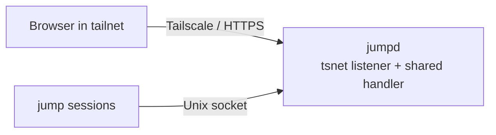
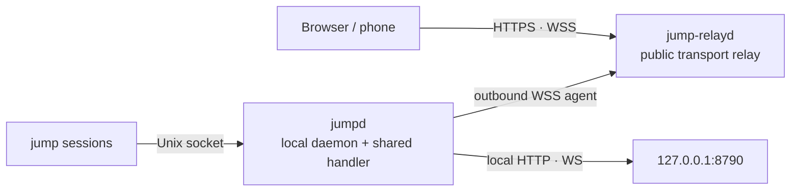

# jump

**Browser-first session manager for AI agents, test runners, and long-running commands.**

jump keeps every wrapped command in a managed PTY session, exposes the sessions through a local web UI, and supports two remote-access modes: private Tailscale/tsnet access and public outbound relay access through `jump-relayd`. The binaries are named `jump`, `jumpd`, and `jump-relayd`.

## Status

This branch is the `sting8k/jump` dev build. Release automation, Homebrew taps, and public install links are not restored yet.

## Install from this branch

This dev branch does not currently ship a supported install script. Clone the branch for development, and restore release/install automation through a dedicated story before publishing user-facing install steps.

```bash
git clone https://github.com/sting8k/jump.git
cd jump
git checkout dev
```

## Quick start

```bash
jump pi                    # launch a coding agent
jump pytest --watch        # launch a test watcher
jump make build            # or any long-running command
jump                       # open the browser UI
```

Open `http://127.0.0.1:8790` if the browser does not open automatically. `jump` auto-starts `jumpd` on first use; for manual control use `jumpd start`, `jumpd status`, `jumpd restart`, and `jumpd stop`.

## Binaries

| Binary | Role |
| --- | --- |
| `jump` | CLI runner. Wraps commands in managed PTY sessions, attaches locally, sends input, tails output, lists sessions, and opens the UI. |
| `jumpd` | Per-machine daemon. Discovers local sessions, caches state, serves the web UI/API/SSE/WS, proxies terminal traffic, reports host metrics, and optionally connects outbound to a relay. |
| `jump-relayd` | Optional public relay. Accepts browser HTTP/WebSocket traffic and forwards it through a single authenticated outbound WebSocket from `jumpd`. |

## How it works

Local access is the baseline. Remote access adds exactly one selected remote transport on top of the same `jumpd` web/API handler.

Local baseline:


Tailscale/tsnet mode:



Relay mode:



In relay mode, `jumpd` connects out to `jump-relayd`; the relay does not need inbound access to your laptop. If the local `jumpd` is offline, the public relay stays up but returns `jump agent not connected`. `jump-relayd` is a transport component, not a session store.

## Current features

### Sessions

- Launch any command with `jump <command>`.
- Attach through the browser terminal or local CLI.
- Keep bounded scrollback for reconnects and dead-session replay for up to 7 days.
- Track alive/dead status, exit codes, unread activity, and adapter state.
- Send input to existing sessions from the CLI or web terminal.

### Web UI

- Project-grouped sidebar with live session state.
- Home panel with an add-workspace form.
- Directory autocomplete for adding workspaces.
- Terminal-like sidebar CPU/RAM metrics.
- Mobile-focused terminal input handling, including safer reconnect behavior and Vietnamese/IME composition handling.

### Remote access

There are two supported remote-access modes, documented in `docs/product/remote-access.md`:

1. Built-in Tailscale/tsnet mode for private tailnet access.
2. Outbound relay mode, served by `jump-relayd`, for public HTTPS/WSS access and NAT traversal.

Provisioning helpers, SSH tunnels, reverse-proxy snippets, and install scripts are setup automation, not additional access modes. Local access is the implicit baseline; `[remote]` is only needed when enabling one of the two remote transports:

```toml
[remote]
mode = "relay" # tsnet | relay

[relay]
url = "wss://your-relay.example.com/_jump/agent"
token = "replace-with-a-shared-secret"
```

Example relay server command:

```bash
jump-relayd -listen :8791 -token "replace-with-a-shared-secret"
```

Put HTTPS in front of `jump-relayd` with your reverse proxy or Cloudflare setup, then point browsers at that public URL.

## Configuration

Main config files:

| Path | Purpose |
| --- | --- |
| `~/.config/jump/host.toml` | Daemon listener, Tailscale, relay, and host behavior. |
| `~/.config/jump/projects.json` | Workspace/project list. |
| `~/.local/state/jump/` | Runtime state, auth token, sockets, logs, and session metadata. |

Useful commands:

```bash
jumpd status       # daemon health, listeners, session counts
jumpd auth         # local auth URL/token
jumpd tsnet        # set up or check Tailscale/tsnet access
jumpd relay        # set up or check relay access
jumpd doctor       # diagnose config, daemon, and remote access
jumpd log-path     # daemon log file path
```

## Development

```bash
pnpm install
```

The root `pnpm build` target includes the Astro website build, which requires Node.js `>=22.12.0`. The previous wrapper scripts under `scripts/` are not part of this branch snapshot. Reintroduce development, build, and install wrappers through a dedicated story with validation evidence.

## Monorepo layout

| Path | Purpose |
| --- | --- |
| `cli/jump` | CLI session runner: PTY, WebSocket, adapters, attach/send/list/tail/wait. |
| `services/jumpd` | Machine daemon: discovery, cache, web/API, auth, metrics, Tailscale, relay client. |
| `services/jump-relayd` | Public relay server for outbound `jumpd` agents. |
| `apps/jump-web` | Preact web UI: sidebar, home/workspaces, terminal, mobile input. |
| `packages/protocol` | TypeScript API/event schemas. |
| `packages/relayproto` | Go relay frame protocol shared by `jumpd` and `jump-relayd`. |
| `packages/scrollback` | Bounded session scrollback persistence. |
| `apps/website` | Upstream-style documentation site; not fully aligned with this fork yet. |

## Notes and caveats

- `jumpd` is auto-started by `jump`, but it is not installed as a boot service by default. Use `jumpd run` under launchd/systemd if you need login/boot autostart.
- Relay mode requires `jumpd` to be running locally. `jump-relayd` can stay online without an agent, but browsers will not reach sessions until the local agent reconnects.
- The root README is aligned for this `jump` dev branch; public release/install automation still needs a dedicated story before publishing.

## License

MIT
